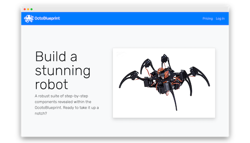
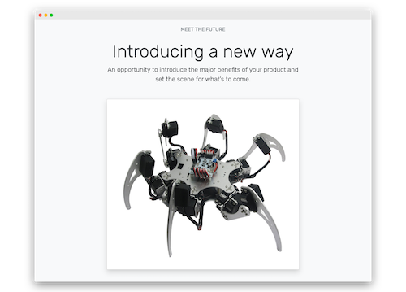
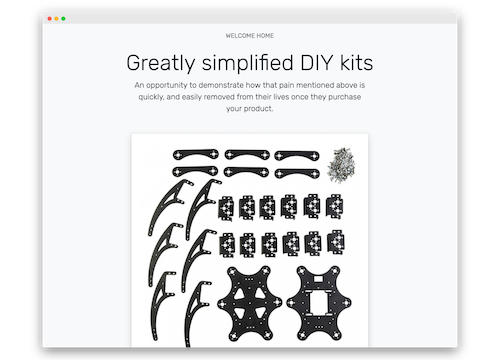
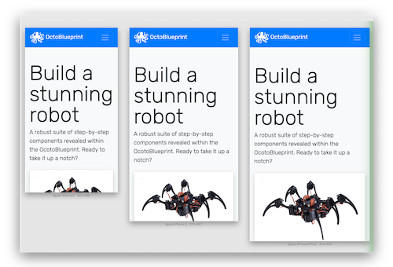
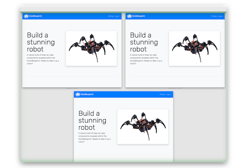
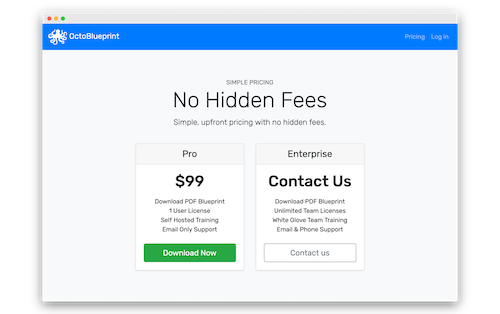
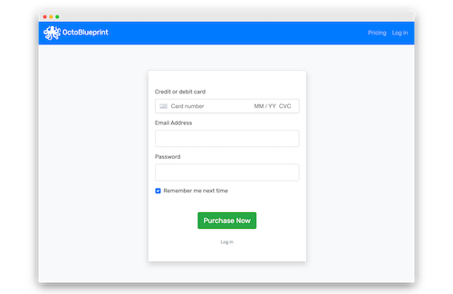
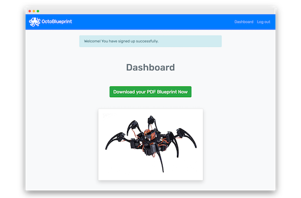

# Rails SaaS Application Template
from [BoilerplateCode.com](https://boilerplatecode.com)

#### Overview

A simple Rails SaaS Framework for membership and billing.

    "I'm wondering if anyone has a good framework for a membership 
    SaaS site? Just something with the basics, Stripe billing, 
    allowing users to login/logout, and to reset passwords?"

##### Absolutely!

I've already created the boring, time consuming, repetitive boilerplate code with a fully Responsive (Mobile, Tablet, Desktop) landing page. 
Simply add business value that customers will pay for.

---

##### Desktop Landing Page:







##### Responsive Mobile Landing Page:



##### Responsive Tablet Landing Page:



##### Desktop Pricing Page:



##### Desktop Payment/Registration Page:



##### Desktop Paid Members Only Page:



---
#### Prerequisites

It's assumed that you've used `Rails` before. You 
[don't need to be an expert](https://guides.rubyonrails.org/),
you could have just learned the framework, but you've setup
`Rails` on you local computer before and have a basic understanding of how it works.

* Make sure you have Git installed `git --version`

* Make sure you have Ruby installed `ruby -v`

    * We are assuming you are using `ruby 2.5.0p0` or above.
    
* Make sure you have Rails installed `rails -v`
    
    * We are assuming you are using `Rails 5.2.3` or above.
    
* Make sure you have Bundler installed `bundle -v`
    
    * We are assuming you are using `Bundler version 1.16.4` or above.    
     
     
#### Getting Started

1. Clone this repo:
 
    * `git clone git@github.com:rails-boilerplate-code/base-template.git`

1. Copy/Paste the following code onto the command line.
    
    * Change `my_new_app` to the name of your application:

        ```bazaar
        rails new my_new_app \
        -m ./base-template/install.rb \
        --skip-action-cable \
        --skip-spring \
        --skip-coffee \
        --skip-turbolinks \
        --skip-bootsnap \
        --skip-test
        ```   
        
1. Go to [Stripe.com](https://stripe.com) and setup a free account. 
   You don't need to have your bank account linked yet, you'll be using "test" mode
   to get started.
   
   1. Make sure you're in TEST mode.
   1. Collect your TEST secret key, and TEST publishable key.
   1. Setup a Product and a SKU
   1. Grab your newly created product id and the sku id.

1. Go to your new Rails App directory and find the `.env` file, add all of the Stripe info from above.   

1. Got to [SendGrid.com](https://sendgrid.com/) and setup a free account. You'll need your SendGrid User, Password, and Domain.

1. Go to your new Rails App directory and find the `.env` file, add all of the SendGrid info from above.

1. `rails s`   
